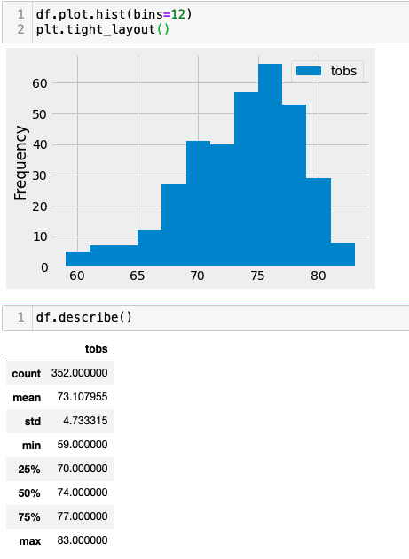
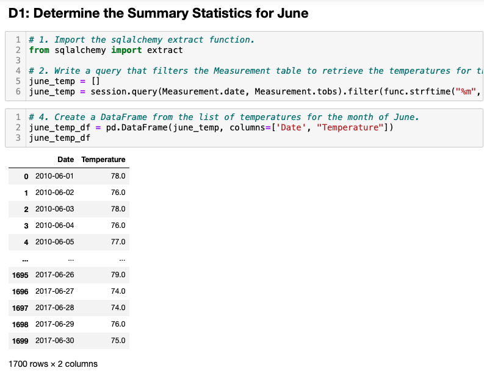
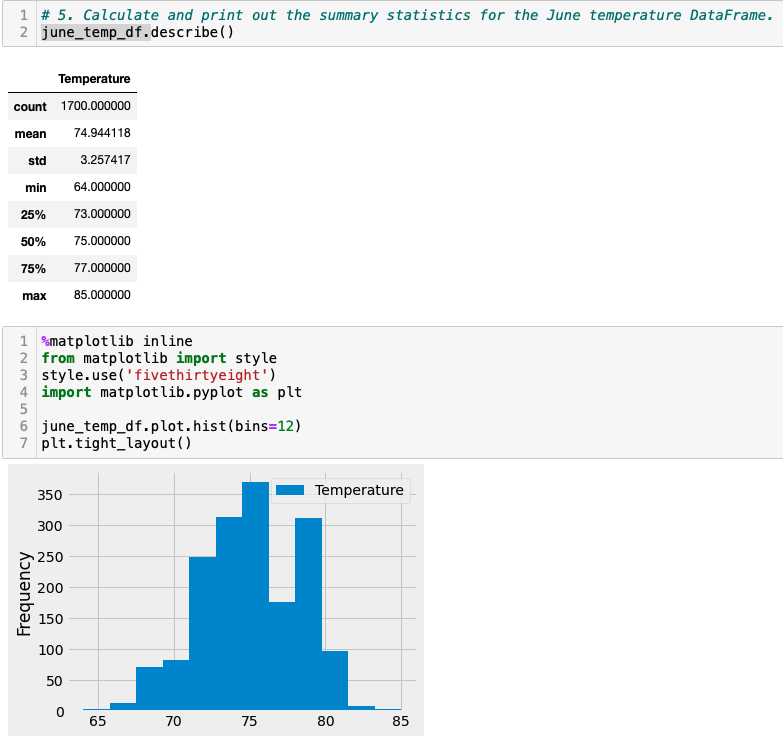
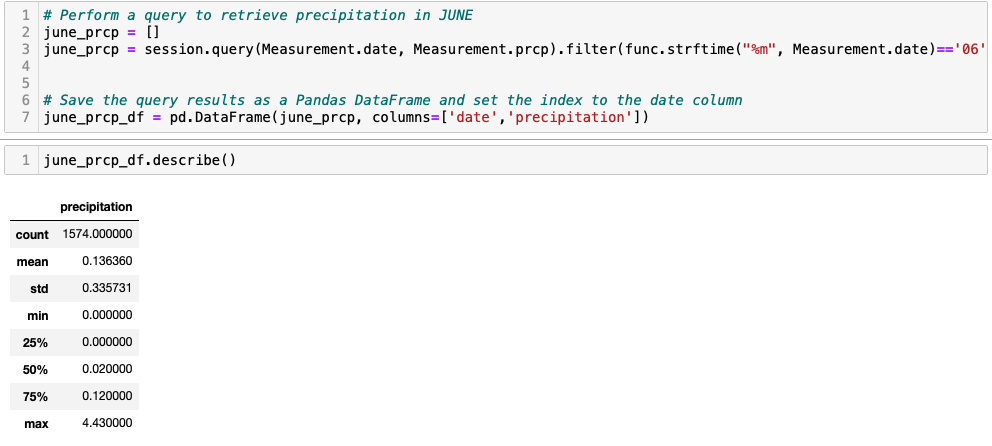
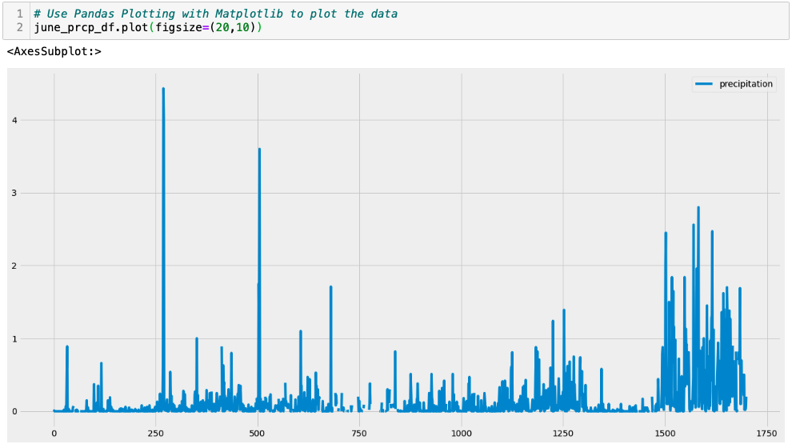
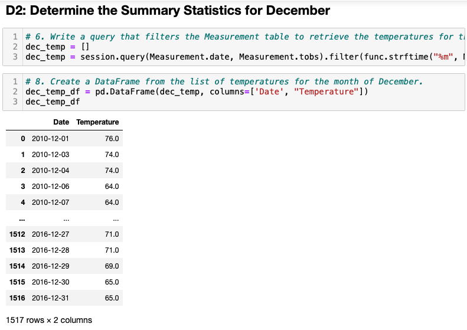
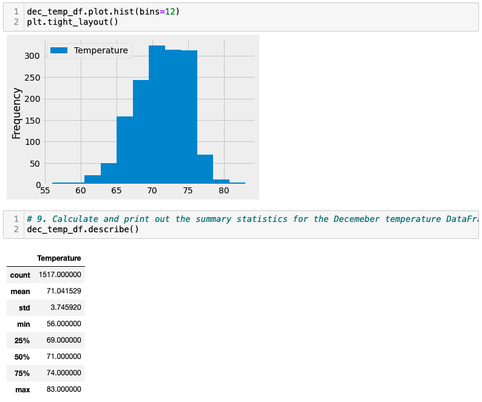
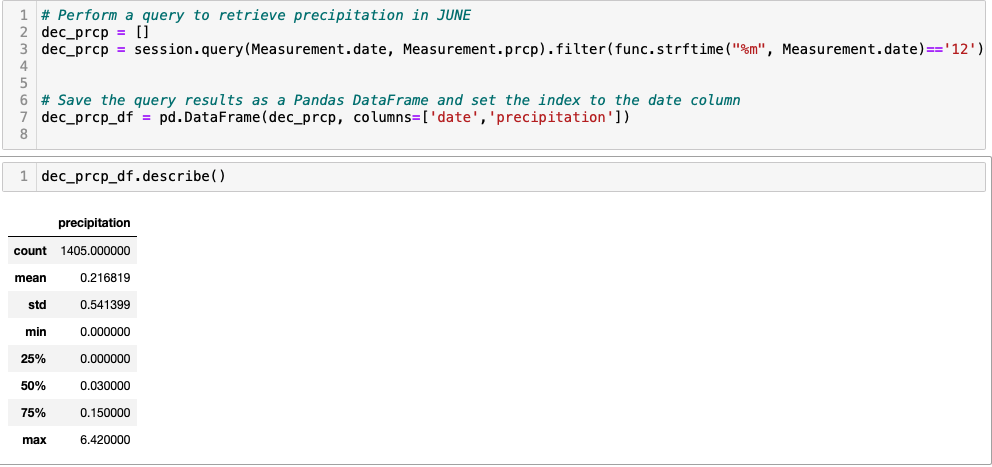
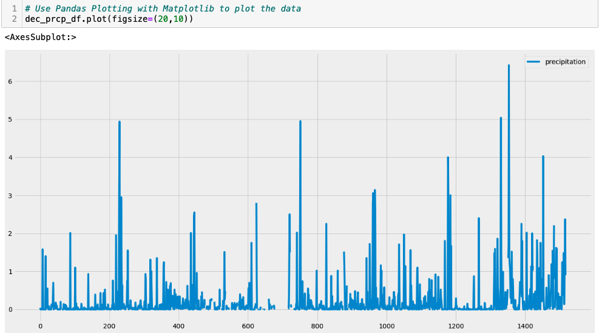

# Surfs_up
## Overview of the analysis
The purpose of this analysis is to run analytics on a weather dataset of Oahu, to see if it is a suitable place to start a Surf n’ Shake business. We will retrieve precipitation information in the period Aug 2016 to Aug 2017 to investigate whether the weather is ideal for surfing and ice cream, which are our business. Secondly, we will retrieve the number of stations from which precipitation data is being collected, and also have active they are to infer the analyze is realiable. Besides, we'll find the minimum, maximum, and average temperatures of the most active station to give a better picture of the weather in Oahu. In addition, we will visulize the results in bar chart. Finally, we will perform analysis on temperature trend, specifically temperature data for the months of June and December in Oahu, in order to determine if the surf and ice cream shop business is sustainable year-round.

We are using Python, Pandas functions and methods, and SQLAlchemy in this analysis.

## Result
* Bar chart for data in most active station

We plot a bat chart of the station which has most of the records. Looking at this plot, we can infer that a vast majority of the observations were over 67 degrees. It is good to show Oahu has a very nice weather and suitable for suring and ice cream.

* Summary Statistics for temperature in June

* Summary Statistics for precipitation in June

* Summary Statistics for temperature in December

* Summary Statistics for precipitation in December

* Key differences in weather between June and Decembe
1. Standard deviation is 3.25 in June while 3.75 in December, making a 0.5 difference between both seasons. This mean weather in June are more close to it average temperature 74.9 while DEcember's are a little far from its mean which is 71.25

2. From the bar charts of each month, we can tell temperature in December is more concentrate on the range 70-75, while temperature range in June is more spread, the second peak is close to 80F.

3. The maximum temperature in June and December is very close, but the minimum temperature varies a lot. The minimum temperature in June is 64F while it is only 56F in December which is not suitable for surfing and ice cream.

4. The precipitation is much higher in DEcember than in June.
## Summary

Oahu is a suitable place for setting up surfing business since the weather is mostly sunny, the wet weather is mainly in winter time from DEcember to March. And the temperature is nice with mean over 70 degree across the year. It's attractive to visitors to stop by and have a successful business.